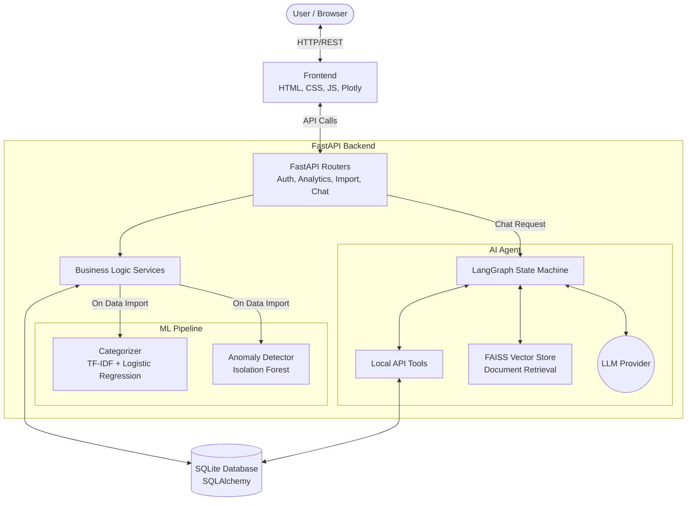

# 💰 AI Personal Finance Advisor

<!-- Feel free to add a screenshot here -->

AI Personal Finance Advisor is a modern, intelligent web application designed to help users manage their finances effortlessly. It goes beyond simple tracking by utilizing Machine Learning (ML) and Large Language Models (LLMs) to automatically categorize transactions, detect unusual spending anomalies, and provide personalized financial advice through a conversational AI assistant.

---

## ✨ Key Features

- **📊 Intelligent Dashboard**: A beautiful, responsive, dual-theme (Light/Dark mode) dashboard providing a comprehensive overview of your net cash flow, income, expenses, and financial health.
- **🤖 AI-Powered Categorization**: Automatically categorizes imported bank statement transactions using a trained Machine Learning model (TF-IDF + Logistic Regression).
- **⚠️ Anomaly Detection**: Uses Isolation Forests (an unsupervised ML algorithm) to detect and flag unusual or potentially fraudulent transactions based on your historical spending behavior.
- **💬 Conversational AI Assistant**: Chat with an intelligent agent built on LangGraph and Large Language Models. The agent uses Retrieval-Augmented Generation (RAG) and tool calling to query your database and provide personalized, data-driven financial insights.
- **📈 Visual Analytics**: Interactive visualizations powered by Plotly to understand your spending habits at a glance.
- **🔐 Secure Authentication**: JWT-based user authentication and secure session management.

---

## 🛠️ Architecture & Tech Stack



The application is built using a modern, scalable architecture separated into distinct layers:

### Backend
- **Framework**: [FastAPI](https://fastapi.tiangolo.com/) - High-performance Python web framework.
- **Database**: [SQLite](https://www.sqlite.org/) with [SQLAlchemy](https://www.sqlalchemy.org/) ORM for robust data modeling and interaction.
- **Machine Learning**: [scikit-learn](https://scikit-learn.org/) for transaction categorization and anomaly detection.
- **AI/LLM Agent**: [LangChain](https://www.langchain.com/) and [LangGraph](https://www.langchain.com/langgraph) to orchestrate the AI chat assistant, leveraging [FAISS](https://faiss.ai/) for RAG (Retrieval-Augmented Generation).

### Frontend
- **Templating**: [Jinja2](https://jinja.palletsprojects.com/) templates served by FastAPI.
- **Styling**: Modern, custom CSS with CSS Variables for seamless Light/Dark mode toggling, supplemented by [Bootstrap 5](https://getbootstrap.com/) for layout grid and base components.
- **Interactivity**: Vanilla JavaScript for API interactions and DOM manipulation.
- **Charting**: [Plotly.js](https://plotly.com/javascript/) for responsive, interactive charts.

---

## 🚀 Quick Start

Follow these steps to run the project locally.

### 1. Prerequisites
- Python 3.10+
- Git

### 2. Clone the Repository & Setup Virtual Environment
```bash
git clone <repository_url>
cd ai-finance-tracker

# Create virtual environment
python -m venv venv

# Activate virtual environment
# On Linux/Mac:
source venv/bin/activate  
# On Windows:
venv\Scripts\activate     
```

### 3. Install Dependencies
```bash
pip install -r requirements.txt
```

### 4. Configure Environment Variables
Copy the example environment file and add your specific configuration (including API keys for the LLM).
```bash
cp .env.example .env
# Edit .env with your settings (e.g., set your XAI_API_KEY for the chat agent)
```

### 5. Run the Application
Start the FastAPI server using Uvicorn.
```bash
uvicorn app.main:app --reload
```

### 6. Access the App
Open your web browser and navigate to:
- **Application**: [http://localhost:8000](http://localhost:8000)
- **Interactive API Documentation (Swagger)**: [http://localhost:8000/docs](http://localhost:8000/docs)
- **Health Check**: [http://localhost:8000/health](http://localhost:8000/health)

---

## 💡 How it Works

1. **Importing Data**: Users start by navigating to the "Import" tab and uploading their bank statements (CSV format). The backend processes this file.
2. **ML Processing**: During import, the transactions are passed through the scikit-learn models. The classifier predicts the `category`, and the anomaly detector assigns an `anomaly_score`.
3. **Dashboard Aggregation**: The dashboard fetches aggregated data via the `/api/analytics/dashboard` endpoint to populate the total balance, income, expenses, pie charts, and lists out anomalies that require user attention.
4. **AI Chat Interaction**: When a user asks a question in the "AI Chat" tab, the LangGraph agent evaluates the intent. It can invoke local tools to query the database (e.g., `get_spending_summary`, `get_recent_transactions`) and uses RAG to fetch financial advice documents to formulate a helpful, personalized response.

---

## 📁 Project Structure

```text
ai-finance-tracker/
├── app/                      # Backend Application Code
│   ├── agent/                # LangGraph AI agent and tools
│   ├── api/                  # FastAPI routers and endpoints
│   ├── auth/                 # Authentication dependencies and security
│   ├── ml/                   # Machine learning models and training scripts
│   ├── models/               # SQLAlchemy database models
│   ├── rag/                  # Retrieval-Augmented Generation logic (FAISS)
│   ├── schemas/              # Pydantic models for request/response validation
│   ├── services/             # Core business logic (analytics, import, budgets)
│   ├── main.py               # FastAPI application factory
│   └── database.py           # DB connection setup
├── frontend/                 # Frontend Assets
│   ├── static/               # CSS, JS, Images
│   └── templates/            # Jinja2 HTML templates
├── ml_models/                # Serialized model artifacts (.pkl files)
├── tests/                    # Pytest test suite
├── .env.example              # Example environment variables
├── requirements.txt          # Python dependencies
└── README.md                 # Project documentation
```

---

## 🛡️ License
This project is licensed under the MIT License.
